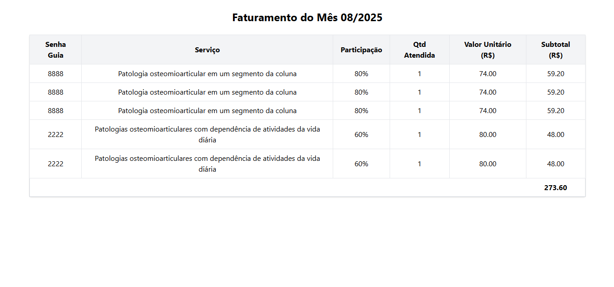

# Sistema de Gestão de Faturamento para Clínicas de Fisioterapia

Este projeto foi desenvolvido com foco no aprendizado em desenvolvimento web e tem como objetivo simular a gestão de faturamento de clínicas de fisioterapia.

O sistema permite:

- Cadastrar pacientes.
- Agendar e acompanhar avaliações com o fisioterapeuta.
- Registrar procedimentos realizados.
- Consultar o faturamento mensal.

Os códigos de serviço utilizados seguem o padrão do Rol de Procedimentos da ANS e os valores atribuídos são fictícios, servindo apenas para fins de estudo e demonstração.

## Tecnologias Utilizadas

- Node.js (Back-end)
- Express.js (Framework)
- SQLite (Banco de dados)
- EJS / HTML / CSS (Interface)

## Objetivo

Este sistema foi criado como parte de um estudo prático para consolidar conhecimentos em:

- Criação de APIs.
- Integração entre front-end e back-end.
- Manipulação de banco de dados.
- Boas práticas de organização de código.

### Imagens do Projeto

#### Tela para Aguardar Agendamento de Avaliação

#### Tela de Agendamento de Avaliação

#### Tela de Atendimento de Tratamento

#### Tela de Faturamento
